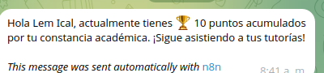
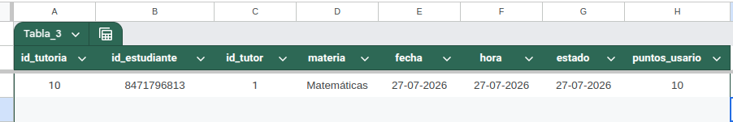

# Sistema de Gestión Académica Automatizado


## Descripción del Proyecto

Este proyecto es una solución integral desarrollada para automatizar la gestión académica y mejorar la comunicación entre los distintos actores del proceso educativo. Utiliza **n8n** como motor de flujos de trabajo (workflow engine), **Telegram** como interfaz de usuario conversacional (UI) y **Google Sheets** como base de datos centralizada. 

El sistema permite a alumnos, tutores y administradores gestionar tutorías, cursos y disponibilidad mediante comandos directos, optimizando los tiempos de respuesta a través de notificaciones en tiempo real.

---

## Características Principales

### 👨‍🎓 Para Alumnos
* **Consulta de Cursos:** Acceso rápido a la información y horarios de los cursos matriculados.
* **Solicitud de Tutorías:** Reserva automática de espacios con tutores disponibles.
* **Notificaciones:** Alertas en tiempo real sobre confirmaciones o cambios en las sesiones.

---
## Uso de Agente de Inteligencia Artificial (Google Gemini)

El sistema integra un **AI Agent** basado en el modelo **Gemini**, el cual actúa como el cerebro cognitivo del flujo en n8n. Esta implementación permite que el bot no solo responda a comandos rígidos, sino que entienda el lenguaje natural de los usuarios.

---

## Arquitectura del Sistema

1. **Interfaz (Frontend):** Bot de Telegram (`@TutorBot`).
2. **Lógica de Negocio (Backend):** Workflows de n8n gestionando enrutamiento condicional y formateo de datos.
3. **Persistencia de Datos (Base de Datos):** Documentos tabulares en Google Sheets (Tablas de Usuarios, Cursos y Registro de Tutorías).

---

## Requisitos Previos

Para desplegar y evaluar este proyecto localmente o en un entorno de pruebas, necesitarás:

* Una instancia de **n8n** (Cloud o Self-hosted mediante Docker).
* Un token de la API de **Telegram Bot** (Obtenido a través de *BotFather*).
* Credenciales de **Google Cloud Console** (Service Account JSON) con la API de Google Sheets habilitada.
* Node.js (v16+) y npm instalados (si se ejecuta n8n localmente).
*   **Google AI API Key:** Credencial necesaria para el nodo de Gemini (obtenida desde Google AI Studio).

---

## 🚀 Instalación y Despliegue

1. **Clonar el repositorio:**
   ```bash
   git clone https://github.com/canuxantonio502/Proyecto_TutorBot_Selvin-Antonio
   ```
## Configuración de Google Sheets:

1. Haz una copia de la Plantilla de Base de Datos en tu Google Drive.

2. Comparte el documento con el correo de tu Service Account de Google Cloud con permisos de "Editor".

## Importación del Workflow en n8n:

1. Abre tu instancia de n8n.

2. Ve a Workflows > Import from File.

3. Selecciona el archivo workflows/gestion_academica.json incluido en este repositorio.

4. Configura las credenciales dentro de n8n para Telegram API y Google Sheets API.


## Guía de Uso (Comandos de Telegram)
Para iniciar el bot, se puede utilizar las siguientes palabras clave:
- Hola
- /start

Después de haber inicializado el bot, el proceso se vuelve interactivo e intuitivo para su fácil uso y comprensió del usuario.

## Metodología y Organización
Este proyecto fue desarrollado bajo principios ágiles (SCRUM), dividiendo las entregas en Sprints enfocados en aportar valor funcional continuo.

**Product Owner:** 
- Selvin Eladio Lem Ical 

**Desarrolladores:** 
- Selvin Eladio Lem Ical
- Marco Antonio Canux Raquec

**Calificadores:**
- Prof. Eduin Salas - *Colombia* - [esalascampuslands](https://github.com/esalascampuslands)
- Prof. Andre López - *Guatemala* - [anndreloopez012](https://github.com/anndreloopez012)

**Skill:** Inteligencia Artificial I

## Licencia
Este proyecto es de carácter académico y fue desarrollado como parte de los requisitos de evaluación en Campuslands.

## Solución de examen selvin Lem 
Lo que se realizo es:

Lógica de Cálculo: cada vez que un alumno marca a que ha finalizado un curso, este se actualiza agregandole 10 pts

Persistencia: Buscar al estudiante en la hoja de usuarios por su telegram_user y sumar los nuevos puntos a su balance actual.

Interfaz: Agregar una nueva opción en el Menú Principal: "4. Ver mis Puntos".

Respuesta del Bot: 



la prueba :


## Desarrollado con ☕ y código por:

* **Selvin Lem** - *Product Owner* - [lemical07](https://github.com/lemical07)
* **Antonio Canux** - *Repository Owner* - [canuxantonio502](https://github.com/canuxantonio502)
